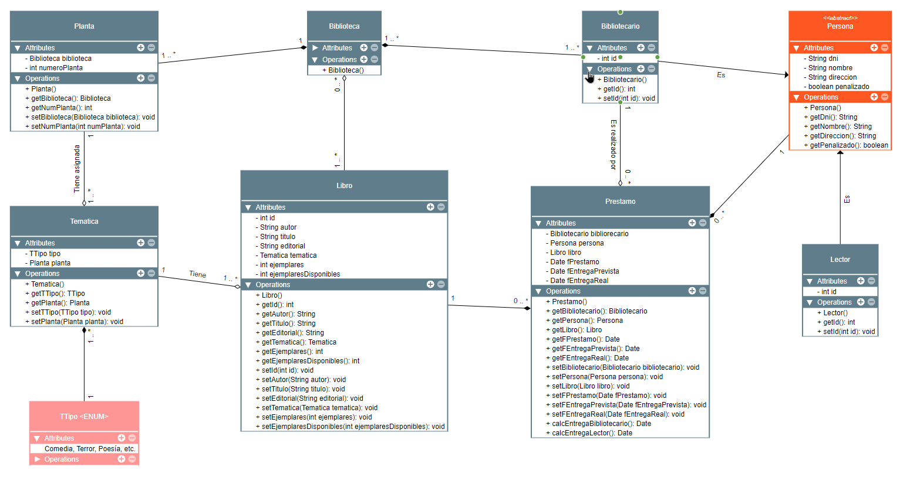

# Examen Entornos de Desarrollo 3er Trimestre

Examen del 3er trimestre de la asignatura **Entornos de Desarrollo** de DAM (CESUR Mallorca) para el curso 2022-2023.

## :clipboard: Enunciado:

## :mag: Análisis de entidades:

Dado el enunciado anterior, se distinguen los siguientes elementos para el diagrama de clases a desarrollar:

## :bulb: Solución propuesta:

## :pencil2: Posibles mejoras y comentarios
- He decidido intentar precisar los temas por integridad de datos mediante una clase ENUM la cual almacenaría todos los temas disponibles. Puede que quede un poco extraño dado que ya existe una clase Tematica como tal.
- Se abstrae la clase Persona ya que ambos, el Bibliotecario y el Lector, poseen los mismos atributos fuera de identificadores internos del sistema.
- Para realizar el cálculo de qué tiempo se dispone para la entrega del préstamo, he decidido crear dos métodos para cada una de las opciones.
- La penalización se ha dejado como un boolean por simplicidad. Durante el examen he planteado la posibilidad de crear una clase Penalizaciones para que se especifiquen de forma más específica, pero para no extender demasiado el diagrama, se ha dejado como se muestra.
